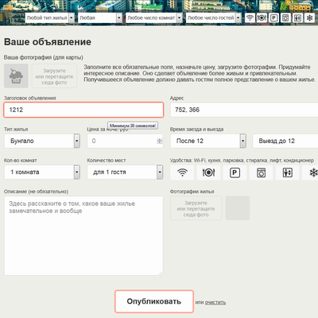

# Личный проект «Кексобукинг» [![Build status][travis-image]][travis-url]

* Студент: [Антон Леонидович](https://up.htmlacademy.ru/javascript/18/user/948947).
* Наставник: [Александр Бабченко](https://htmlacademy.ru/profile/babtshe).

---
### Описание
Кексобукинг — сервис размещения объявлений о сдаче в аренду недвижимости в центре Токио. Проект интенсива *«JavaScript. Профессиональная разработка веб-интерфейсов»*. Демонстрация навыков программирования. Дизайн, контент, HTML и CSS - собственность HTML-академии. Весь JavaScript-код полностью мой.

[Посмотреть готовую работу](https://utavegu.github.io/948947-keksobooking-18/)

---

 
